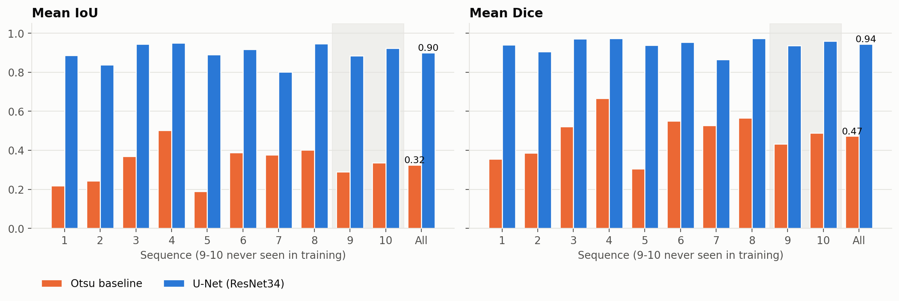
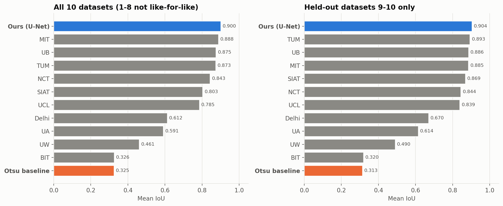

# Instrument Segmentation

Binary segmentation of robotic surgical instruments on the EndoVis 2017
dataset (RBE544). A fine-tuned U-Net (ResNet34 encoder) is compared to a
classical Otsu-thresholding baseline and to the 10 teams from the
[2017 challenge paper](https://arxiv.org/abs/1902.06426).

## Results at a glance

Mean per-frame foreground IoU on the official test frames (all numbers
are generated by the scripts below; see `results/`).

| Method | IoU, all 10 datasets | IoU, held-out datasets 9-10 |
|---|---:|---:|
| Otsu baseline | 0.325 | 0.313 |
| **U-Net (ResNet34)** | **0.900** | **0.904** |
| Best challenge team (all 10: MIT / held-out: TUM) | 0.888 | 0.893 |
| Mean of the 10 challenge teams | 0.706 | 0.731 |




**Training vs. test frames.** Each sequence has 300 frames. The train and
test sets never share a frame (verified: no common file paths and no
byte-identical images), but they relate to each other differently
depending on the sequence:

| Sequences | Training frames | Test frames | Test video seen in training? |
|---|---|---|---|
| 1-8 | frames 0-224 (225 each, 1,800 total) | frames 225-299 (75 each, 600 total) | Yes: same videos, earlier in time |
| 9-10 | none | all 300 frames each (600 total) | No: never loaded for training |

Total test set: 1,200 frames. Sequence 1-8 test frames immediately follow
the training frames in the same video, so they show nearly the same scene,
lighting and instruments. Sequences 9 and 10 are entirely new videos, so
they are the real test of generalization.

**Read the challenge comparison carefully.** Only datasets 9 and 10 are a
like-for-like comparison:

- The challenge forbade training on the first 225 frames of the sequence
  being tested (teams trained 9 models). This project trains one model on
  the first 225 frames of sequences 1-8 and tests on the last 75 frames of
  those same videos, which is easier. Sequences 9 and 10 are never used in
  training, so they are the fair check.
- The official test masks for sequences 1 and 2 omit a visible instrument
  on some frames, so they were replaced with self-computed masks
  (`scripts/data_prep/fix_test_masks.py`). Scores there are against
  different ground truth than the paper's.
- The model was trained for 25 epochs and only training loss is logged
  (no validation loss), so the loss curve shows optimization progress, not
  generalization.

Full tables: [`results/tables/`](results/tables/)
(`baseline_vs_model`, `challenge_per_dataset`, `challenge_leaderboard`).

## Repository layout

```
segmentation/            Importable library code shared by all scripts
  paths.py                 Default file locations (dataset, results, ...)
  crop.py                  1920x1080 frame -> 1280x1024 camera view
  dataset.py               Train/test split and PyTorch Dataset
  metrics.py               IoU / Dice, per-sequence evaluation, JSON output
  model.py                 U-Net builder, device selection, inference
  visualize.py             Qualitative input/ground-truth/prediction overlays
  reporting.py             Load metrics JSON, weighted means, Markdown/CSV tables
  plotting.py              Shared matplotlib style and per-method colors
scripts/
  data_prep/               Get the dataset into shape (run once)
  training/                Train the U-Net
  evaluation/              Score the baseline and the trained model
  analysis/                Plots and comparison tables from saved results
reference/                 Numbers transcribed from the challenge paper
results/
  metrics/                 Evaluation JSON (baseline_threshold, model_eval)
  logs/                    Training loss log (train_log.csv)
  overlays/                Qualitative prediction images
  figures/                 Plots (PNG)
  tables/                  Comparison tables (Markdown + CSV)
dataset/ , checkpoints/    Downloaded data / model weights (git-ignored)
```

## Setup

```bash
python3 -m venv .venv
./.venv/bin/python -m pip install -r requirements.txt
./.venv/bin/python -m pip install -r requirements-dev.txt  # optional, for formatting
```

Place the EndoVis 2017 training data under `dataset/training/`
(`instrument_dataset_1` ... `instrument_dataset_10`, each with
`left_frames/` and `ground_truth/`).

All scripts are run **as modules from the repo root** so the
`segmentation` package is importable. Every script accepts `--help`.

## Running the pipeline

### 1. Prepare the data (once)

```bash
# Merge the per-instrument-class masks into one binary mask per frame
# (writes instrument_dataset_N/binary_masks/).
./.venv/bin/python -m scripts.data_prep.make_binary_masks

# Download the official test-split binary masks (~40 MB) into dataset/test/.
./.venv/bin/python -m scripts.data_prep.download_test_masks

# Replace the incomplete official masks for sequences 1 and 2 with our own
# (backs up originals to *_official_backup/). Re-run this if you ever
# re-run download_test_masks.
./.venv/bin/python -m scripts.data_prep.fix_test_masks
```

### 2. Train

```bash
# Fine-tunes the U-Net on frames 0-224 of sequences 1-8 with a Dice loss.
# Writes checkpoints/unet_resnet34.pt, results/logs/train_log.csv and
# overlays in results/overlays/sanity_train/.
./.venv/bin/python -m scripts.training.train_model --epochs 25

# If a run is interrupted after epoch 12:
./.venv/bin/python -m scripts.training.train_model --epochs 25 \
    --resume checkpoints/unet_resnet34.pt --start-epoch 13
```

### 3. Evaluate

```bash
# Otsu baseline -> results/metrics/baseline_threshold.json
./.venv/bin/python -m scripts.evaluation.baseline_threshold

# Trained model -> results/metrics/model_eval.json
./.venv/bin/python -m scripts.evaluation.evaluate_model
```

Both score each of the 10 sequences separately against the official test
masks (sequences 1-8: last 75 frames; 9-10: all 300) and report a
per-sequence breakdown plus overall means. Use `--limit N` for a quick
smoke test on N frames per sequence.

### 4. Make the graphs and tables

```bash
./.venv/bin/python -m scripts.analysis.plot_training_loss
./.venv/bin/python -m scripts.analysis.compare_baseline_vs_model
./.venv/bin/python -m scripts.analysis.compare_to_challenge
```

These only read saved files, so they run in seconds and need no GPU or
dataset.

## What each script does

| Script | Purpose | Main outputs |
|---|---|---|
| `data_prep/make_binary_masks.py` | Merge per-class masks into binary masks | `dataset/training/*/binary_masks/` |
| `data_prep/download_test_masks.py` | Fetch official test masks from Hugging Face | `dataset/test/` |
| `data_prep/fix_test_masks.py` | Fix omitted instruments in sequences 1-2 test masks | updated `dataset/test/`, backups |
| `training/train_model.py` | Train the U-Net | checkpoint, `logs/train_log.csv`, `overlays/sanity_train/` |
| `evaluation/baseline_threshold.py` | Otsu saturation-threshold baseline | `metrics/baseline_threshold.json`, `overlays/baseline/` |
| `evaluation/evaluate_model.py` | Evaluate a trained checkpoint | `metrics/model_eval.json`, `overlays/model/` |
| `analysis/plot_training_loss.py` | Plot loss per epoch | `figures/training_loss.png` |
| `analysis/compare_baseline_vs_model.py` | Baseline vs U-Net per sequence | `figures/baseline_vs_model.png`, `tables/baseline_vs_model.*` |
| `analysis/compare_to_challenge.py` | Compare to the 10 challenge teams (best, mean, rank) | `figures/challenge_*.png`, `tables/challenge_*.*` |

## Method notes

- **Split.** The test set of each sequence is whatever frame names exist in
  the official test masks (frames 225-299 for sequences 1-8, all 300 frames
  for 9-10). Training uses every other frame of sequences 1-8. There is
  no train/test overlap: the 1,800 training frames and 1,200 test frames
  share no file paths and no byte-identical images. Note that the
  sequence 1-8 test frames come from the same videos as the training
  frames (just later in time), so only sequences 9-10 test generalization
  to unseen videos.
- **Metric.** Per-frame foreground IoU (and Dice), averaged over frames in
  a dataset. "Overall" is weighted by frame count, as in the challenge
  paper; an unweighted mean of sequences is also stored in the JSON.
- **Baseline.** Otsu threshold on the HSV saturation channel (instruments
  are desaturated metal against saturated tissue), followed by a
  morphological open/close.
- **Model.** `segmentation_models_pytorch` U-Net with an ImageNet-pretrained
  ResNet34 encoder, run at 320x256, trained with soft-Dice loss and Adam
  (lr 1e-4, batch 8). Predictions are upsampled to the native 1280x1024
  crop for scoring.
- **Challenge reference.** `reference/endovis2017_binary_results.json` is
  Table I of the paper, checked against the paper's own mean column,
  frame-weighted overall row and win counts.

## Code style

- **Python**: [PEP 8](https://peps.python.org/pep-0008/). Formatted with
  `black`, configured in `pyproject.toml` (installed via
  `requirements-dev.txt`). Run before committing:
  ```bash
  ./.venv/bin/python -m black .
  ```

- **C++**: [Google C++ Style Guide](https://google.github.io/styleguide/cppguide.html).
  Formatted with `clang-format` (`.clang-format` at the repo root sets
  `BasedOnStyle: Google`). Run before committing:
  ```bash
  clang-format -i path/to/file.cpp path/to/file.h
  ```
